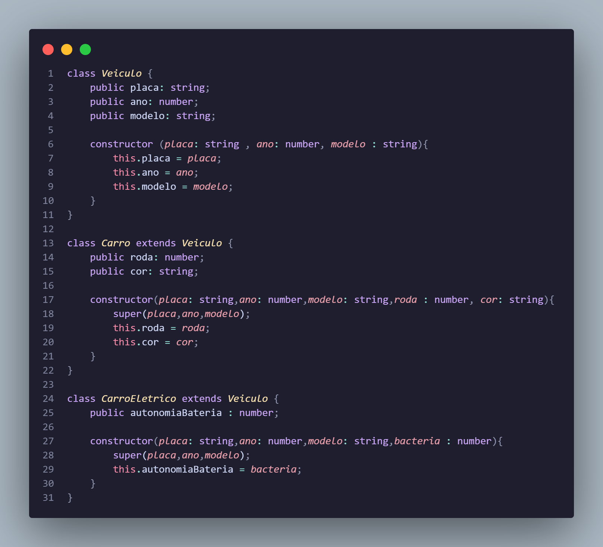
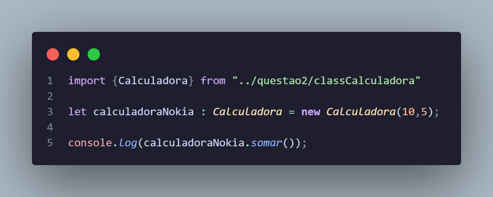
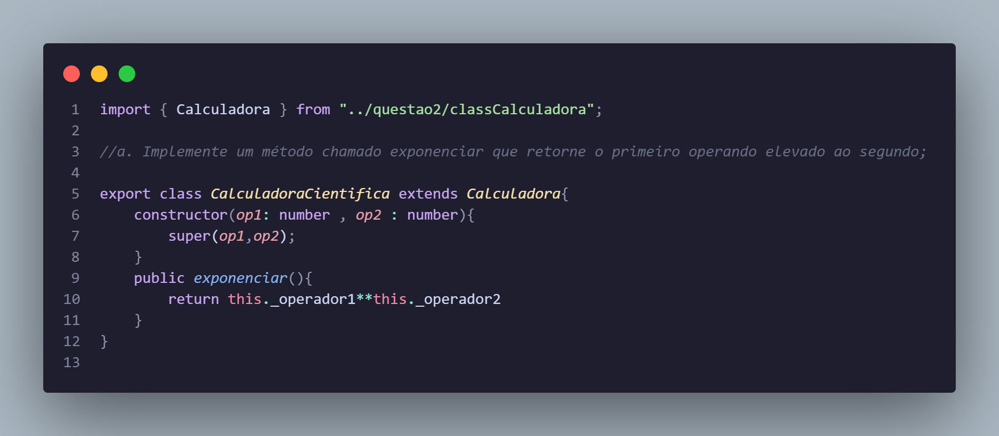
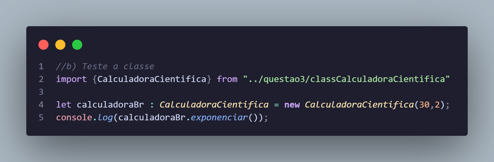

<h4>EXERCICIO ATIVIDADE 07 ate 4-a</h4>

        <h4>questao 1)</h4>
        

        <h4>questao 2)</h4>
         <h4>Teste</h4>
        

        <h4>questao 3)</h4>
        
        
        <h4>c) Foi necessária alguma modificação em Calculadora para o acesso aos atributos?</h4>Sim, foi necessario modificar o tipo de acesso dos atributos da Calculadora de privados para protected,pois as subclasses não conseguem ter acesso aos atributos private, protected é util quando voce quer que os membros da classe sejam acesseveis por outras por subclasses.</h4>

        <h4>questao 4)</h4><h4>implementado na pasta "questao4"</h4>

        <h4>CONTINUAÇAO...

b. Adicione a aplicação a possibilidade de ter o cadastro de ContaImposto
feita em sala de aula. Foi necessário alterar alguma coisa na classe Banco
ou apenas na classe App?</h4>

Não foi preciso fazer alteração em Banco, pois ela já trata as operações de forma genérica para qualquer objeto que seja uma instância da classe Conta ou subclasse,conta imposto herda de conta e sobrescreve metodo sacar, quando metodo sacar é chamado pela instancia de ContaImposto, a funçao sobrescrita sera executada e classe Banco apenas
chama o metodo sacar da Conta, sem a necessidade de saber qual e o tipo da conta.
Em classe App foi preciso fazer alteração em incluir a opcao de criar conta tipo contaImposto e a função sacar, para que caso o usuario queira sacar em uma conta imposto.</h4>

        <h4>questao 5)</h4><h4>implementado na pasta "questao5"</h4>

