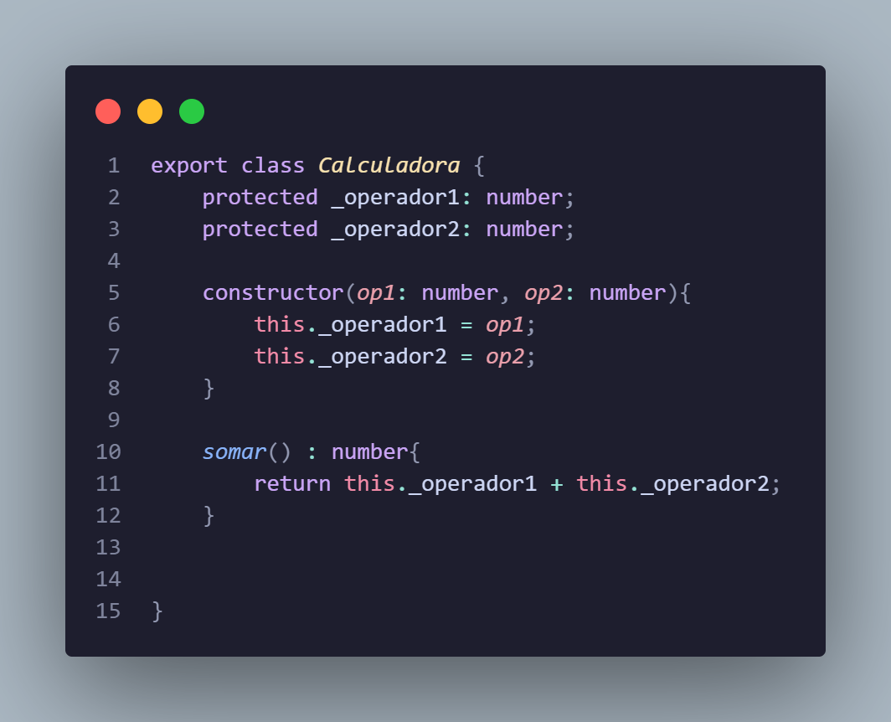

<h4>EXERCICIO ATIVIDADE 07 ate 4-a</h4>

        <h4>questao 1)</h4>
        

        <h4>questao 2)</h4>
         <h4>Teste</h4>
        

        <h4>questao 3)</h4>
        
        
        <h4>c) Foi necessária alguma modificação em Calculadora para o acesso aos atributos?</h4>Sim, foi necessario modificar o tipo de acesso dos atributos da Calculadora de privados para protected,pois as subclasses não conseguem ter acesso aos atributos private, protected é util quando voce quer que os membros da classe sejam acesseveis por outras por subclasses.</h4>

        <h4>questao 4)</h4><h4>implementado na pasta "questao4"</h4>

